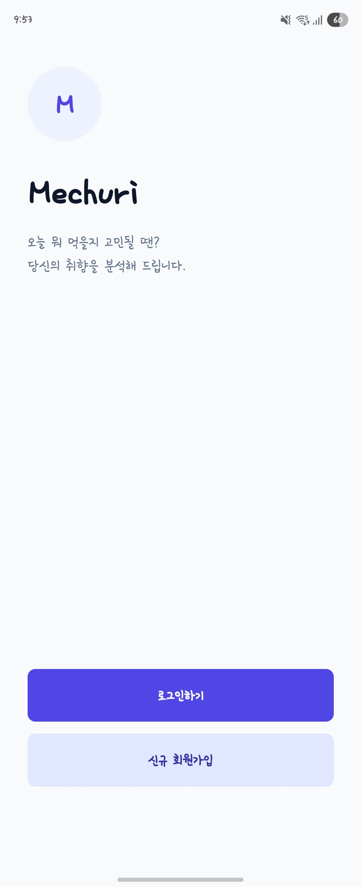
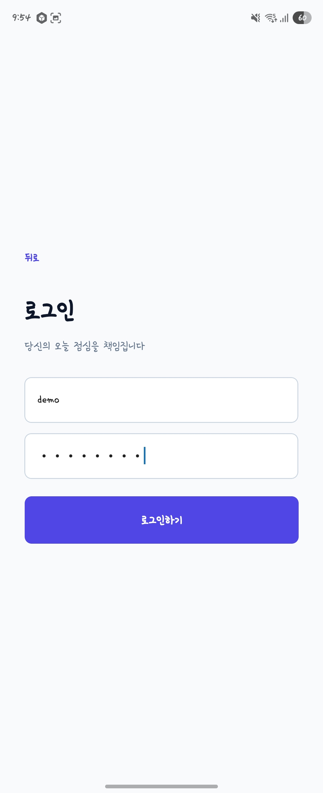
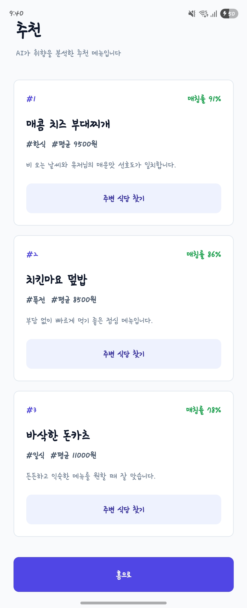
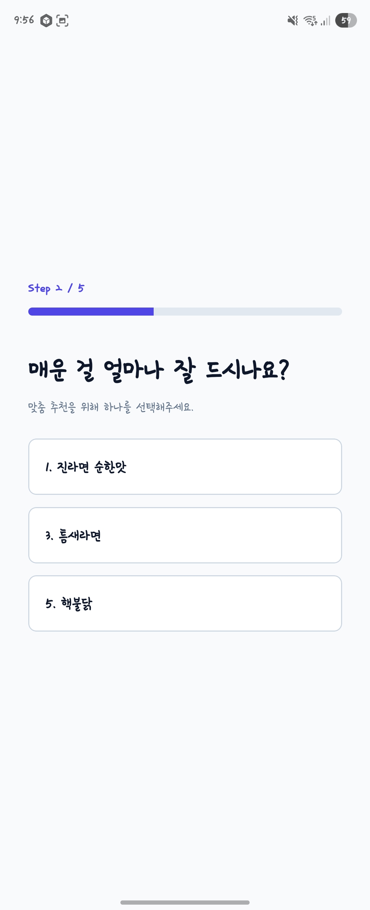
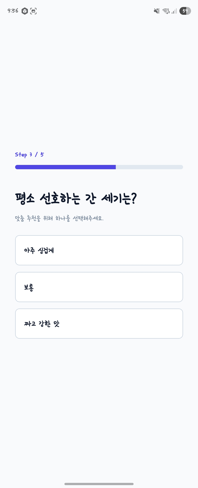
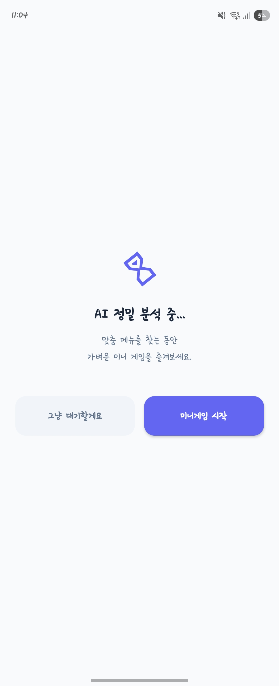
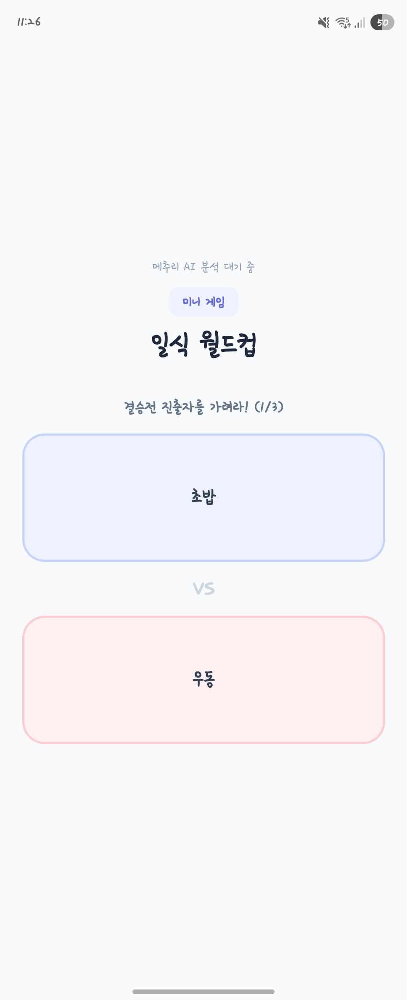
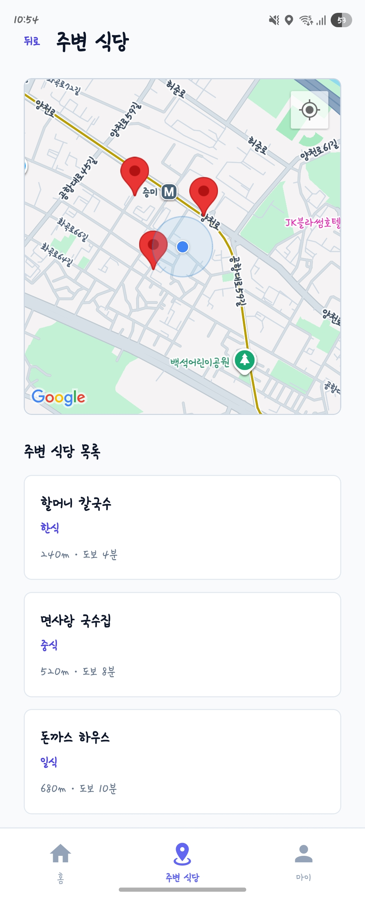

# Mechuri

오늘 점심을 고르기 어려운 사용자를 위해 취향, 예산, 맛 선호도, 현재 위치를 바탕으로 메뉴와 주변 식당을 추천하는 모바일 앱입니다.  
이 프로젝트에서 가장 중요하게 다룬 부분은 단순히 화면을 만드는 것이 아니라, 추천에 사용할 수 있는 음식점 데이터를 직접 수집하고 정제하며 결측치를 줄여 앱에서 바로 쓸 수 있는 형태로 만드는 과정이었습니다.

<p align="center">
  
  
  
</p>

## 프로젝트를 시작한 이유

처음에는 “오늘 뭐 먹지?”라는 흔한 고민에서 출발했습니다. 메뉴 추천 앱을 만들려면 프론트엔드 화면이나 추천 API도 필요하지만, 그보다 먼저 “추천할 수 있는 음식점 데이터”가 제대로 준비되어야 한다는 점을 알게 되었습니다.

그래서 데이터 분석 입문 과정에서 배운 내용을 바로 프로젝트에 적용했습니다. 엑셀 데이터를 열어 행과 컬럼을 확인하고, 결측치가 어디에 많은지 확인하고, 카테고리 값이 실제 서비스에 적합한지 하나씩 점검했습니다. 이 과정에서 `pandas`를 이용한 데이터 확인, `value_counts()` 기반 분포 파악, 결측치 처리, 중복 제거, API 보강, 규칙 기반 재분류를 반복하며 데이터 분석의 기본 흐름을 익혔습니다.

이 프로젝트의 데이터 분석은 완성된 머신러닝 모델을 학습시키는 방식이라기보다, 사람이 데이터를 관찰하면서 규칙을 만들고 다시 검증하는 방식에 가깝습니다. 즉, 데이터의 상태를 보고 문제를 발견한 뒤, 더 좋은 추천 데이터가 되도록 정제 규칙을 계속 개선했습니다.

## User Flow

사용자는 앱에 접속한 뒤 로그인하거나 회원가입을 진행합니다. 이후 취향 설문을 통해 식단, 매운맛, 짠맛, 예산, 새로운 메뉴 선호 여부를 입력하고, 앱은 이 정보를 바탕으로 추천 메뉴를 보여줍니다. 추천 메뉴에서 주변 식당 찾기를 누르면 현재 위치 기준 주변 식당과 도보 시간을 확인할 수 있습니다.

<p align="center">
  
  
  
</p>

1. 앱 진입
   - Mechuri 소개 화면에서 로그인 또는 회원가입을 선택합니다.
2. 취향 입력
   - 식단 제한, 매운맛 정도, 간 선호도, 예산, 새로운 메뉴 도전 여부를 선택합니다.
3. 추천 분석
   - 사용자의 응답값을 추천 API로 전달하고, 분석 대기 중에는 미니게임 화면을 제공해 지루함을 줄였습니다.
4. 메뉴 추천
   - 메뉴명, 카테고리, 평균 가격, 매칭률, 추천 사유를 보여줍니다.
5. 주변 식당 확인
   - 추천 메뉴와 연결된 주변 식당을 지도와 목록으로 확인합니다.

<p align="center">
  
  
  
</p>

## 데이터 분석 입문 과정에서 배운 흐름

처음 데이터를 봤을 때 가장 먼저 확인한 것은 “이 데이터가 추천에 바로 쓸 수 있는가?”였습니다. 원천 데이터에는 음식점이 아닌 업종도 섞여 있었고, 주소와 좌표가 비어 있는 행도 있었으며, 카테고리도 너무 넓거나 서비스 목적과 맞지 않는 경우가 있었습니다.

그래서 다음 순서로 접근했습니다.

1. 데이터 구조 확인
   - 행 수, 컬럼 수, 컬럼명, 데이터 타입을 확인했습니다.
   - 음식점명, 주소, 카테고리, 위도, 경도처럼 추천에 반드시 필요한 컬럼을 먼저 구분했습니다.
2. 결측치 확인
   - 컬럼별 결측치 개수를 확인했습니다.
   - 특히 주소, 좌표, 카테고리 결측은 추천 품질에 직접 영향을 주기 때문에 따로 관리했습니다.
3. API로 정보 보강
   - Kakao Local API를 이용해 식당명 기반으로 실제 주소, 좌표, 카테고리를 다시 가져왔습니다.
   - 검색어에 `관악구`를 붙여 다른 지역의 같은 이름 식당이 잘못 매칭되는 문제를 줄였습니다.
4. 서비스 목적에 맞지 않는 데이터 제거
   - 카페, 편의점, 약국, 부동산, 미용, 숙박, 주점류 등 일반 식사 추천과 거리가 있는 데이터를 제거했습니다.
5. 카테고리 재분류
   - Kakao API의 넓은 카테고리를 앱에서 쓰기 좋은 대분류와 소분류로 다시 나눴습니다.
   - 음식점명에 포함된 메뉴명과 브랜드명을 이용해 한식, 중식, 일식, 양식, 치킨, 피자, 버거, 샐러드 등을 세분화했습니다.
6. 최종 검증
   - 최종 데이터에서 `name`, `address`, `latitude`, `longitude`, `category_1`, `category_2` 결측치가 남아 있지 않은지 확인했습니다.
   - 최종적으로 2,343개의 음식점 데이터를 앱 서비스용 데이터로 정리했습니다.

## 데이터 정제 과정

### 1. 원천 데이터 확인

원천 데이터에는 서울 또는 관악구 음식점 후보 데이터가 들어 있었습니다. 하지만 추천 앱에서 바로 쓰기에는 몇 가지 문제가 있었습니다.

| 문제 | 영향 | 처리 방향 |
|---|---|---|
| 주소 결측 | 지도 표시와 위치 기반 추천이 어려움 | Kakao API로 주소 보강 |
| 위도/경도 결측 | 거리 계산 불가 | Kakao API로 좌표 보강 |
| 카테고리 결측 | 메뉴 추천 분류가 어려움 | 기본값 처리 후 재분류 또는 제거 |
| 음식점 외 업종 포함 | 추천 결과 품질 저하 | 카테고리 기준 필터링 |
| 중복 매장 포함 | 같은 식당 반복 추천 가능 | 식당명 + 주소 기준 중복 제거 |

초기 데이터에는 좌표가 비어 있는 행이 있었고, 카테고리가 비어 있거나 너무 넓은 값도 있었습니다. 그래서 “결측을 단순히 아무 값으로 채우기”보다, 실제 서비스에서 의미 있는 값으로 보강하는 것을 우선했습니다.

### 2. Kakao API로 결측 보강

좌표와 주소 결측은 평균값으로 채우기 어렵습니다. 음식점 위치 데이터에서 위도와 경도는 숫자이지만, 평균값을 넣으면 실제 위치가 아닌 엉뚱한 장소가 됩니다. 따라서 이 프로젝트에서는 좌표 결측을 통계값으로 채우지 않고 Kakao Local API를 이용해 다시 조회했습니다.

검색은 식당명만 사용하지 않고 다음처럼 지역명을 함께 붙였습니다.

```python
query = f"관악구 {name}"
params = {"query": query, "size": 1}
```

이렇게 보강한 값은 다음과 같습니다.

| 보강 데이터 | 사용 이유 |
|---|---|
| 주소 | 식당 목록과 상세 정보 표시 |
| 위도 | 현재 위치와의 거리 계산 |
| 경도 | 현재 위치와의 거리 계산 |
| Kakao 카테고리 | 초기 음식점 분류 라벨 |

이 과정을 거치면서 최종 데이터에서는 `latitude`, `longitude` 결측치가 0개가 되었습니다.

### 3. 카테고리 결측 처리

카테고리가 비어 있으면 분류 함수가 멈추거나 추천 필터에서 누락될 수 있습니다. 그래서 카테고리 값이 없을 때는 우선 `기타`로 처리했습니다.

```python
def split_category(cat_str):
    if pd.isna(cat_str) or cat_str == '':
        return '기타', '기타'
```

다만 `기타`를 최종 데이터에 많이 남기는 것은 추천 품질에 좋지 않습니다. 그래서 `기타`로 임시 처리한 뒤, 음식점명과 Kakao 카테고리를 다시 확인해 가능한 것은 한식, 분식, 양식, 일식 등으로 재분류했습니다. 끝까지 서비스 목적과 맞지 않거나 분류가 애매한 데이터는 제거했습니다.

### 4. 계층형 카테고리 분리

Kakao API의 카테고리는 보통 다음처럼 길게 들어옵니다.

```text
음식점 > 한식 > 육류,고기 > 삼겹살
```

이 값을 그대로 쓰면 앱에서 필터나 추천 기준으로 사용하기 어렵습니다. 그래서 `음식점`처럼 너무 넓은 최상위 값은 제거하고, 남은 값으로 대분류와 소분류를 만들었습니다.

```python
parts = [p.strip() for p in cat_str.split('>')]

if '음식점' in parts:
    parts.remove('음식점')

if len(parts) >= 2:
    return parts[0], parts[1]
elif len(parts) == 1:
    return parts[0], parts[0]
else:
    return '기타', '기타'
```

이렇게 만든 컬럼은 다음과 같습니다.

| 컬럼 | 의미 | 예시 |
|---|---|---|
| `category_1` | 큰 음식 분류 | 한식, 일식, 중식, 양식 |
| `category_2` | 실제 추천에 가까운 세부 분류 | 고기구이, 국밥, 초밥/스시, 파스타/스테이크 |

### 5. 음식점 외 데이터 제거

추천 서비스의 목적은 식사 메뉴와 주변 음식점을 추천하는 것입니다. 그래서 다음과 같은 데이터는 제거했습니다.

```python
exclude_list = ['카페', '미용', '가정,생활', '부동산', '편의점', '숙박', '스포츠', '의료']
```

추가로 제과점, 약국, 마트, 주점류, 포장마차, 모호한 기타 업종도 후반부에서 다시 제거했습니다. 이 단계는 추천 결과에 “밥 먹을 곳”이 아닌 장소가 섞이지 않도록 하기 위한 품질 관리였습니다.

### 6. 중복 제거

같은 식당이 여러 번 들어오면 추천 결과에서 같은 장소가 반복될 수 있습니다. 그래서 식당명과 주소를 기준으로 중복을 제거했습니다.

```python
df_final = df_filtered.drop_duplicates(subset=['name', 'address'], keep='first')
df_final = df_final.reset_index(drop=True)
```

식당명만 기준으로 잡지 않은 이유는 같은 이름의 지점이 여러 곳 있을 수 있기 때문입니다. 반대로 주소만 기준으로 잡으면 같은 건물 안의 다른 매장을 잘못 합칠 수 있습니다. 그래서 `name + address` 조합을 사용했습니다.

## 결측치를 채운 방식

이 프로젝트에서 결측치를 처리할 때는 컬럼의 의미에 따라 다르게 접근했습니다.

| 컬럼 종류 | 처리 방식 | 이유 |
|---|---|---|
| 주소 | Kakao API로 재조회 | 임의 값으로 채우면 실제 장소 정보가 틀어짐 |
| 위도/경도 | Kakao API로 재조회 | 평균값 대체가 위치 데이터에는 부적절함 |
| 카테고리 | `기타` 임시 입력 후 재분류 | 분류 함수 오류 방지와 후속 보정 목적 |
| 거리 | 기본값 0으로 초기화 | 앱 실행 시 사용자 위치 기준으로 다시 계산할 수 있음 |
| 도보 시간 | `fillna(0)` 또는 기본값 0 | 표시 오류와 정수 변환 오류 방지 |
| 엑셀 인덱스 | 제거 | DB 적재에 필요하지 않은 컬럼 |

거리와 도보 시간은 최종 엑셀에서는 모두 0으로 초기화되어 있습니다. 이는 실제 거리가 0이라는 의미가 아니라, 앱 실행 시점의 사용자 위치 기준으로 다시 계산하기 위한 기본 구조에 가깝습니다.

```python
df[['distance','walking_time']] = 0
```

추천 로직에서는 거리 계산 후 도보 시간을 만들 때 다음처럼 결측을 방지했습니다.

```python
df['walking_time'] = (df['distance'] / 80 + 1).fillna(0).round().astype(int)
```

즉, 도보 시간이 비어 있으면 화면 표시나 정수 변환에서 오류가 날 수 있으므로 `0`으로 안전하게 채웠습니다.

## 카테고리 재분류 기준

카테고리 재분류는 이 프로젝트에서 가장 많이 반복한 작업입니다. Kakao API 카테고리는 좋은 출발점이었지만, 앱의 추천 기준으로는 너무 넓거나 실제 음식군과 맞지 않는 경우가 있었습니다.

예를 들어 `한식`이라는 값만 있으면 사용자는 무엇을 먹게 될지 알기 어렵습니다. 그래서 음식점명과 카테고리 키워드를 함께 보고 `고기구이`, `국밥`, `찌개/탕`, `백반/가정식`, `한식면요리`처럼 더 구체적인 값으로 바꿨습니다.

### 한식

| 키워드 | 재분류 |
|---|---|
| 국밥, 순대국, 해장국 | 국밥 |
| 감자탕, 삼계탕, 설렁탕, 매운탕 | 탕/찌개 |
| 삼겹살, 갈비, 곱창, 막창 | 고기구이 |
| 족발, 보쌈 | 족발/보쌈 |
| 국수, 칼국수, 냉면, 막국수 | 한식면요리 |
| 백반, 정식, 쌈밥, 집밥 | 백반/가정식 |

### 일식

| 키워드 | 재분류 |
|---|---|
| 초밥, 스시, SUSHI | 초밥/스시 |
| 돈까스, 돈가스, 카츠 | 돈까스 |
| 라멘, 우동, 소바, 메밀 | 일식면요리 |
| 덮밥, 돈부리, 가츠동 | 일식덮밥 |
| 카레 | 일식카레 |

### 양식과 패스트푸드

| 키워드 | 재분류 |
|---|---|
| 파스타, 스테이크, 이탈리 | 파스타/스테이크 |
| 피자, PIZZA | 피자 |
| 버거, BURGER, 수제버거 | 햄버거 |
| 샐러드, 포케, POKE | 샐러드 |
| 샌드위치, SUBWAY, 토스트 | 샌드위치 |

### 브랜드 기반 통합

치킨과 피자는 브랜드명이 강하게 드러나는 경우가 많아 별도 규칙을 사용했습니다.

```python
if any(brand in name for brand in chicken_brands) or cat1 == '치킨':
    return '치킨'

if any(brand in name for brand in pizza_brands) or cat1 == '피자':
    return '피자'
```

이 규칙 덕분에 같은 치킨집이나 피자집이 서로 다른 카테고리로 흩어지는 문제를 줄일 수 있었습니다.

## 최종 데이터

정제와 재분류를 거친 최종 데이터는 추천 앱에서 바로 사용할 수 있는 형태로 정리했습니다.

| 항목 | 결과 |
|---|---:|
| 최종 음식점 수 | 2,343개 |
| 주소 결측치 | 0개 |
| 위도/경도 결측치 | 0개 |
| 대분류/소분류 결측치 | 0개 |
| 주요 기준 지역 | 서울 관악구 |
| DB 적재 테이블 | `restaurants` |

최종 DB에 사용하는 핵심 컬럼은 다음과 같습니다.

```text
name, address, latitude, longitude, category_1, category_2, distance, walking_time
```

최종 데이터는 원천 데이터를 그대로 넣은 것이 아니라, API 보강, 결측 처리, 중복 제거, 음식점 외 업종 제거, 카테고리 재분류를 모두 거친 서비스용 데이터입니다.

## 추천 로직 개요

추천은 사용자의 설문 응답과 음식점 데이터를 연결하는 방식으로 구성했습니다.

설문에서 받는 값은 다음과 같습니다.

| 사용자 입력 | 추천에 쓰이는 의미 |
|---|---|
| 식단 제한 | 채식/일반식 등 필터 조건 |
| 매운맛 선호 | 메뉴 매운맛 점수와 비교 |
| 간 선호 | 짠맛 선호도와 비교 |
| 예산 | 평균 가격 또는 예산 상한 |
| 도전 성향 | 익숙한 메뉴 또는 새로운 메뉴 선호 |

위치 기반 추천에서는 Haversine 공식을 사용해 현재 위치와 음식점 좌표 사이의 거리를 계산했습니다. 이후 가까운 순서로 정렬하되, 같은 카테고리만 반복되지 않도록 카테고리 다양성도 함께 고려했습니다.

```python
df_recommend = (
    df.sort_values(by='distance')
      .drop_duplicates(subset=['category'], keep='first')
      .head(5)
)
```

## 기술 스택

| 영역 | 사용 기술 |
|---|---|
| Frontend | React Native, Expo |
| Backend | FastAPI, SQLAlchemy |
| Database | SQLite, MySQL/PostgreSQL 대응 구조 |
| Data | Python, pandas, openpyxl |
| API | Kakao Local API |
| Map | react-native-maps, expo-location |

## 실행 방법

### Frontend

```bash
cd frontend
npm install
npm start
```

### Backend

```bash
cd backend
pip install -r requirements.txt
uvicorn app.main:app --reload
```

## 프로젝트를 통해 배운 점

이 프로젝트를 하면서 데이터 분석은 거창한 모델 학습에서만 시작되는 것이 아니라, 데이터를 열어보고 이상한 값을 찾는 일에서 시작된다는 것을 배웠습니다. 결측치가 있다고 무조건 평균이나 최빈값으로 채우는 것이 아니라, 그 컬럼이 실제 서비스에서 어떤 의미인지 먼저 판단해야 했습니다.

특히 위치 데이터는 평균값으로 채우면 안 되고, 주소와 좌표는 실제 장소와 연결되어야 하기 때문에 API 보강이 더 적합했습니다. 카테고리 역시 비어 있다고 단순히 `기타`로 끝내는 것이 아니라, 음식점명과 브랜드명, 메뉴 키워드를 이용해 다시 분류해야 추천 품질이 좋아졌습니다.

결국 이 프로젝트의 핵심은 “앱이 추천할 수 있는 믿을 만한 데이터셋을 직접 만든 것”입니다. 원천 데이터에서 출발해 결측을 보강하고, 불필요한 업종을 제거하고, 사람이 이해하기 쉬운 카테고리로 다시 정리하면서 데이터 분석과 서비스 개발이 어떻게 연결되는지 경험할 수 있었습니다.
